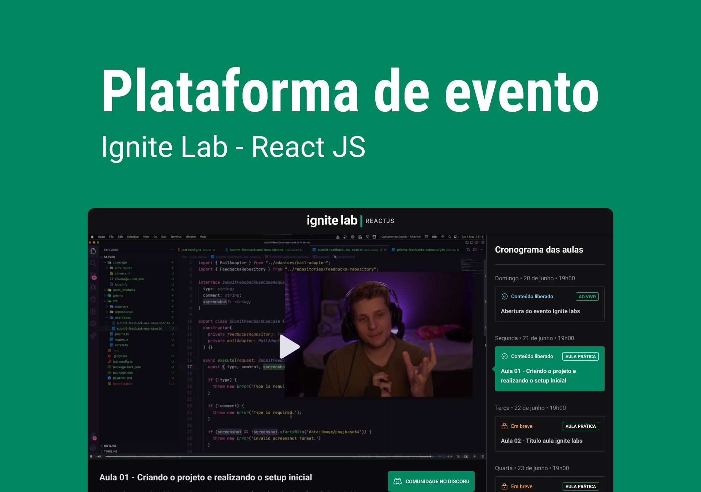

  

  <a href="https://event-platform-sage.vercel.app/">Link</a> &nbsp;&nbsp;&nbsp;|&nbsp;&nbsp;&nbsp;
  <a href="#sobre">Sobre</a> &nbsp;&nbsp;&nbsp;|&nbsp;&nbsp;&nbsp;
  <a href="#tecnologias">Tecnologias</a> 

---

# Sobre
Pude participar de mais um evento oferecido pela Rocketseat, o Ignite Lab | ReactJS. 
Construimos uma aplicação completa usando as tecnologias mais modernas.

O Event Platform é uma aplicação na qual você poderá cadastrar vários eventos por meio de um headless CMS e acessar os detalhes de cada evento cadastrado.

# Tecnologias e Ferramentas
- React
- TypeScript
- Tailwind CSS
- Classnames
- Date FNS
- GraphQL
- GraphQL Codegen
- Graph CMS
- Phosphor React
- React Router Dom
- Vite

